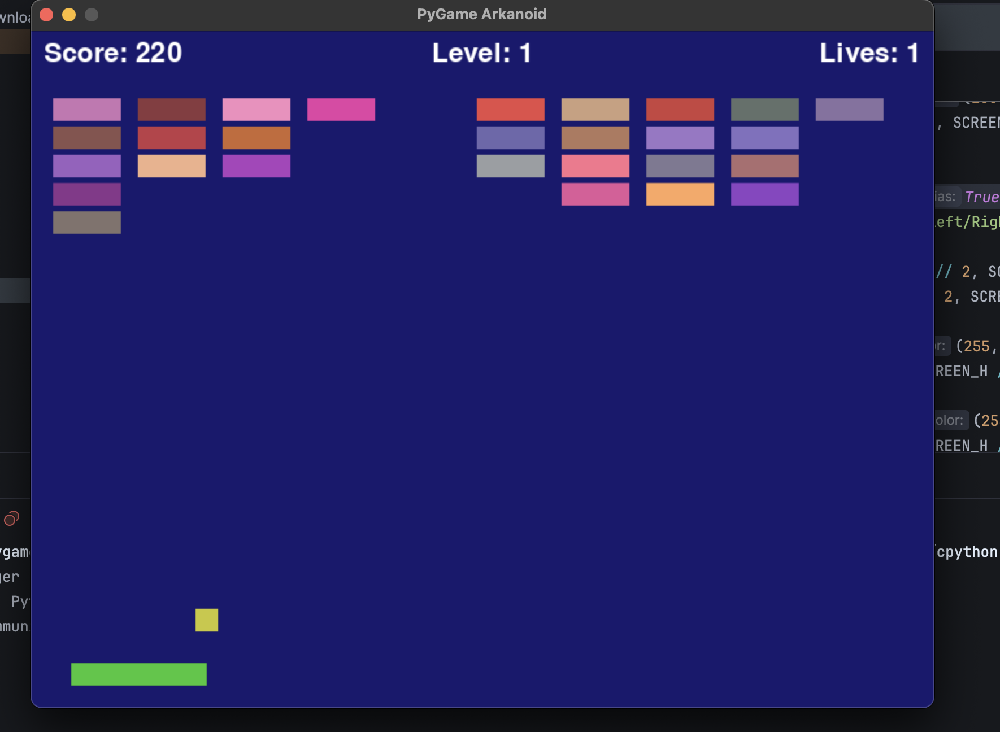

# Arkanoid Game



## Preparation & Installation

### 1. Automatic Install (macOS & Linux)

```bash
sh install.sh
```

### 2. Manual Install

**Create a virtual environment**

```bash
python3 -m venv env
```

**Activate your virtual environment**

```bash
# macOS & Linux
source ./env/bin/activate

# Windows (PowerShell)
.\env\Scripts\activate
```

**Install dependencies**

```bash
pip3 install -r requirements.txt
```

**Go to the working directory**

```bash
cd work
```

**Run the game**

```bash
python3 main.py
```

---

## Features

* Smooth paddle controls with keyboard arrow keys.
* Multiple block colors and random layouts.
* Bonuses & power-ups:

  * Expand Paddle — increases platform size.
  * Shrink Paddle — decreases platform size.
  * Laser Mode — shoot blocks with beams.
* Dynamic ball physics and bouncing mechanics.
* Particle effects when blocks are destroyed.
* Simple, clean, and easy-to-modify codebase.

---

## Requirements

Make sure you have:

* Python 3.8+
* Pygame installed

Install Pygame with:

```bash
pip install pygame
```

---

## How to Run

1. Download the game files (`main.py` + `game_objects.py`).
2. Open a terminal in the game folder.
3. Run:

```bash
python main.py
```

4. Enjoy the game.

---

## Controls

| Key         | Action                                |
| ----------- | ------------------------------------- |
| Left Arrow  | Move paddle left                      |
| Right Arrow | Move paddle right                     |
| Space       | Shoot laser (if laser mode is active) |
| Esc         | Quit game                             |
